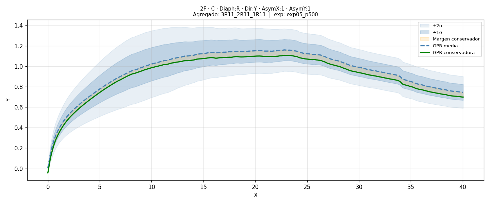

# Regresión Funcional de Curvas 

Modelo que, dados los parámetros de una vivienda (número de plantas, posición en el agregado, tipo de diafragma, dirección de análisis y niveles de asimetría), predice la curva espectral correspondiente.

---

## Estructura del directorio

```
dataset_generative/
├── Aggregate_dwellings/
│   └── *.txt
├── Isolated_dwellings/
│   └── *.txt
├── indicaciones de nomenclatura utilizada.txt
├── dataset_processor.py
├── gpr_model.py
├── predict_gpr.py
├── analyze_experiment.py
├── pyproject.toml          ← generado por uv
├── uv.lock                 ← generado por uv
└── README.md
```

Resultados generados automáticamente:
```
dataset_generative/
├── processed/
│   ├── datasets.json               ← registro de versiones de dataset
│   ├── dataset_p256.pt
│   ├── dataset_p128.pt
│   └── ...
└── experiments/
    ├── all_results.jsonl           ← registro global de experimentos
    └── <nombre_experimento>/
        ├── gpr_model.pkl
        ├── results.json
        ├── loo_plot.png
        ├── bias_plot.png
        └── analysis/               ← generado por analyze_experiment.py
            ├── overview.png
            ├── summary.json
            └── curves/
                └── *.png
```

---

## Instalación

### Con uv (recomendado)

`uv` gestiona el entorno virtual y las dependencias automáticamente.

```bash
# Instalar uv (una sola vez en el sistema)
curl -LsSf https://astral.sh/uv/install.sh | sh

# Ir al directorio del proyecto
cd FragilityCurves

# Crear entorno e instalar dependencias
uv venv
source .venv/bin/activate
uv sync --active
```

A partir de aquí, prefija cada comando con `uv run`:

```bash
uv run python dataset_processor.py --data_dir . --output_dir ./processed --n_points 256
```

### Con venv estándar

```bash
python -m venv .venv
source .venv/bin/activate        # Linux/macOS
# .venv\Scripts\activate         # Windows

pip install torch numpy scipy scikit-learn matplotlib joblib
```

---

## Nomenclatura de los archivos .txt

```
{floors}-{position}-{diaphragm}-{direction}-{asym_x}-{asym_y}-{unit_L}_{unit_C}_{unit_R}.txt
```

Ejemplo: `3-L-R-Y-1-1-3R11_3R11_2R11.txt`
- 3 plantas · posición izquierda · diafragma rígido · dirección Y
- Asimetría X=1, Y=1
- Agregado: izq=3R11, centro=3R11, dcha=2R11

Cada token `NdXY` del agregado representa una vivienda:
- `N` → número de plantas (1, 2 o 3)
- `d` → tipo de diafragma (`R` rígido, `F` flexible)
- `X` → nivel de asimetría en X
- `Y` → nivel de asimetría en Y

Para viviendas aisladas el descriptor es `ISOL_ISOL_ISOL`.

---

## Paso 1 — Procesar los datos
Las curvas definidas en los .txt no siempre tienen la misma longitud (cantidad de puntos `(X,Y)`). el script `dataset_processor.py` procesa los .txt y genera el dataset en formato .pt fijando la cantidad de puntos que deben tener las curvas. Lo que hace es calcular el rango de las `X`, generar los `n_points` puntos equiespaciados e interpolar el valor de las `Y`.

Este script por tanto parsea los nombres de archivo, carga las curvas, las interpola a longitud fija y genera tensores PyTorch. Cada ejecución genera un archivo versionado según `--n_points` y actualiza `processed/datasets.json`.

```bash
python3 dataset_processor.py \
    --data_dir . \
    --output_dir ./processed \
    --n_points 256
```

| Argumento | Descripción | Default |
|---|---|---|
| `--data_dir` | Directorio raíz (`.` si ya estás en él) | requerido |
| `--output_dir` | Dónde guardar los tensores procesados | `./processed` |
| `--n_points` | Puntos de interpolación. Genera `dataset_p<n>.pt` | `256` |
| `--plot` | Muestra una figura con 6 curvas de muestra | off |

**Salida en `./processed/`:**
- `dataset_p256.pt` — tensores X e Y, splits e índices, eje X global
- `X_features_p256.pt` — tensor `(N, 27)` de features codificadas
- `Y_curves_p256.pt` — tensor `(N, 256)` de curvas interpoladas
- `datasets.json` — registro acumulativo de todas las versiones generadas

El script busca recursivamente en `Aggregate_dwellings/` e `Isolated_dwellings/` y excluye el archivo de indicaciones automáticamente. El rango X se calcula como el mínimo y máximo global entre todos los archivos.

Para generar varias versiones y compararlas:

```bash
python3 dataset_processor.py --data_dir . --n_points 256
python3 dataset_processor.py --data_dir . --n_points 128
```

> **Nota:** Ya se ha generado los datasets con 128, 256 y 500 puntos de interpolación. Está en el repo (mirar `processed/`). Si quieres crear el dataset con una cantidad diferente de puntos de interpolación, usa los comandos de arriba indicando otros `--n_points`. A menor puntos, menor *resolución* de curvas, pero más rápido es de entrenar el modelo.

---

## Paso 2 — Entrenar el modelo GPR

El modelo usa **PCA + Gaussian Process Regression**: comprime cada curva en N componentes principales, ajusta un GPR independiente por componente, y reconstruye la curva completa al predecir. Apropiado para datasets pequeños (~85 muestras) y produce predicciones con incertidumbre.

La evaluación se hace con **Leave-One-Out CV**: cada curva se predice sin haberla usado en el entrenamiento, lo que da la estimación más honesta posible con tan pocas muestras.

```bash
python3 gpr_model.py \
    --exp_name exp01_baseline \
    --dataset ./processed/dataset_p256.pt \
    --n_components 15 \
    --conservative_bias 0
```

Cada experimento se guarda en `./experiments/<exp_name>/`.

| Argumento | Descripción | Default |
|---|---|---|
| `--exp_name` | Nombre del experimento (también nombre de la carpeta) | requerido |
| `--dataset` | Ruta al `dataset_pXXX.pt` a usar | `./processed/dataset.pt` |
| `--n_components` | Componentes PCA para comprimir las curvas | `15` |
| `--matern_nu` | Suavidad del kernel Matérn (`0.5`, `1.5` o `2.5`) | `2.5` |
| `--n_restarts` | Reinicios del optimizador del kernel | `5` |
| `--conservative_bias` | Margen fijo de corrección conservadora en unidades de Y | `0.05` |
| `--bias_correction_factor` | Factor sobre el bias observado en LOO | `1.0` |
| `--summary` | Muestra tabla comparativa de todos los experimentos y sale | off |

### Corrección conservadora

Durante el LOO el modelo calcula cuánto sobreestima la predicción punto a punto. Si `--conservative_bias > 0`, resta ese bias observado más un margen fijo adicional, de modo que la curva predicha tienda a quedar por debajo de la real. La métrica `below%` indica el porcentaje de puntos donde la predicción conservadora queda por debajo de la curva real.

> **Nota:** Esto lo hago porque Miguel me ha comentado que es más interesante que la curva predicha quede por debajo de la curva real, a que quede por arriba. Para un `conservative_bias = 0`, no se impone ese sesgo en el entrenamiento del modelo.


### Ejemplos de experimentos

```bash
# Baseline sin corrección
python3 gpr_model.py --exp_name exp01_baseline \
    --dataset ./processed/dataset_p256.pt \
    --n_components 5 --conservative_bias 0

# Con corrección conservadora moderada
python3 gpr_model.py --exp_name exp02_conserv \
    --dataset ./processed/dataset_p256.pt \
    --n_components 5 --conservative_bias 0.05

# Más componentes PCA
python3 gpr_model.py --exp_name exp03_pca10 \
    --dataset ./processed/dataset_p256.pt \
    --n_components 10 --conservative_bias 0.05

# Dataset con menos puntos
python3 gpr_model.py --exp_name exp04_p128 \
    --dataset ./processed/dataset_p128.pt \
    --n_components 5 --conservative_bias 0.05

# Dataset con más puntos
python3 gpr_model.py --exp_name exp05_p500 \
    --dataset ./processed/dataset_p500.pt \
    --n_components 5 --conservative_bias 0.05
```

> **Nota:** En mi portátil (un Thinkpad T480s con un i5-8350U) tarda 1 min. aprox. por cada entrenamiento. No usa GPU, solo CPU.

### Ver resumen comparativo de todos los experimentos

```bash
python3 gpr_model.py --summary
```

Muestra una tabla con `R²`, `RMSE`, `below%` y el dataset usado para cada experimento:

```
────────────────────────────────────────────────────────────────────────────────────────────────────────────────────────
Experimento                  Dataset          n_comp   var%   bias      R²     RMSE  below%  R²_cons  below%_c
────────────────────────────────────────────────────────────────────────────────────────────────────────────────────────
exp01_baseline               dataset_p256.pt       5   99.8  0.000  0.7949  0.16056    51.0   0.7949      51.0
exp02_conserv                dataset_p256.pt       5   99.8  0.050  0.7949  0.16056    51.0   0.7755      72.1
exp03_pca10                  dataset_p256.pt      10   99.9  0.050  0.7949  0.16057    51.1   0.7755      72.2
exp04_p128                   dataset_p128.pt       5   99.8  0.050  0.7947  0.16042    51.0   0.7752      72.1
exp05_p500                   dataset_p500.pt       5   99.8  0.050  0.7949  0.16067    51.0   0.7756      72.1
────────────────────────────────────────────────────────────────────────────────────────────────────────────────────────
```

**Salida por experimento en `./experiments/<exp_name>/`:**
- `gpr_model.pkl` — modelo serializado (GPRs, PCA, scaler, corrección)
- `results.json` — métricas LOO completas y configuración
- `loo_plot.png` — curvas reales vs predichas (6 muestras aleatorias)
- `bias_plot.png` — bias medio por punto a lo largo del eje X

---

## Paso 3 — Analizar un experimento

Una vez identificado un buen experimento, este script genera un análisis completo sobre todo el dataset: predicción, incertidumbre y comparación con la curva original para cada muestra.

```bash
python3 analyze_experiment.py --exp_name exp05_p500
```

El dataset se lee automáticamente del `results.json` del experimento. Si fuera necesario indicarlo manualmente, por ejemplo:

```bash
python3 analyze_experiment.py \
    --exp_name exp02_conserv \
    --dataset ./processed/dataset_p256.pt
```

| Argumento | Descripción | Default |
|---|---|---|
| `--exp_name` | Experimento a analizar | requerido |
| `--dataset` | Dataset a usar (opcional si está en `results.json`) | auto |

**Salida en `./experiments/<exp_name>/analysis/`:**
- `overview.png` — panel con todas las curvas del dataset en una sola figura
- `summary.json` — métricas por curva (R², RMSE, below%, máximo de sobreestimación)
- `curves/` — un PNG individual por cada curva

Cada plot muestra:
- Curva original en negro
- Media GPR en azul discontinuo
- Bandas de incertidumbre ±1σ y ±2σ en azul con transparencia
- Curva conservadora en verde punteado
- Zona verde donde la conservadora queda por debajo de la real (segura)
- Zona roja donde la conservadora sobreestima (zona a vigilar)

---

## Paso 4 — Predecir una curva nueva

Genera la curva para una combinación de parámetros no presente en el dataset.

```bash
python3 predict_gpr.py \
    --exp_name exp05_p500 \
    --floors 2 \
    --position C \
    --diaphragm R \
    --direction Y \
    --asym_x 1 \
    --asym_y 1 \
    --agg "3R11_2R11_1R11" \
    --plot
```

| Argumento | Opciones | Descripción |
|---|---|---|
| `--exp_name` | nombre | Experimento a usar (debe estar entrenado) |
| `--floors` | `1`, `2`, `3` | Número de plantas |
| `--position` | `I`, `L`, `C`, `R` | Posición en el agregado |
| `--diaphragm` | `R`, `F` | Tipo de diafragma (rígido/flexible) |
| `--direction` | `X`, `Y` | Dirección de análisis |
| `--asym_x` | `1`, `2`, `3`, `5` | Nivel de asimetría en X |
| `--asym_y` | `1`, `2`, `3`, `5` | Nivel de asimetría en Y |
| `--agg` | e.g. `3R11_2R11_1R11` | Descriptor del agregado |
| `--plot` | flag | Muestra y guarda la curva predicha |

Para viviendas aisladas usar `--position I --agg ISOL_ISOL_ISOL`.

**Salida en `./experiments/<exp_name>/`:**
- PNG con la curva base y la curva conservadora superpuestas
- CSV con columnas `x`, `y_base`, `y_conservative`

Para este ejemplo, la curva predicha (normal y conservadora) con su rango de incertidumbre es:
 

---

## Descripción del problema

**Tipo:** Regresión funcional: dado un vector de parámetros discretos/ordinales, el modelo predice una curva continua completa.

**Features de entrada (27 dimensiones):**
- Position one-hot `[I, L, C, R]` — 4 dims
- Diaphragm R/F — 1 dim
- Direction X/Y — 1 dim
- Floors normalizado — 1 dim
- AsymX, AsymY normalizados al rango 1–5 — 2 dims
- 3 × unidad del agregado codificada (floors, diaphragm, asym_x, asym_y, is_isol) — 18 dims

**Evaluación:** Leave-One-Out Cross-Validation sobre las 85 muestras disponibles.